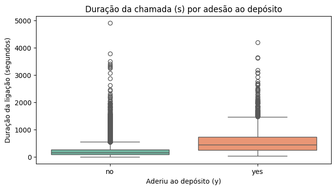
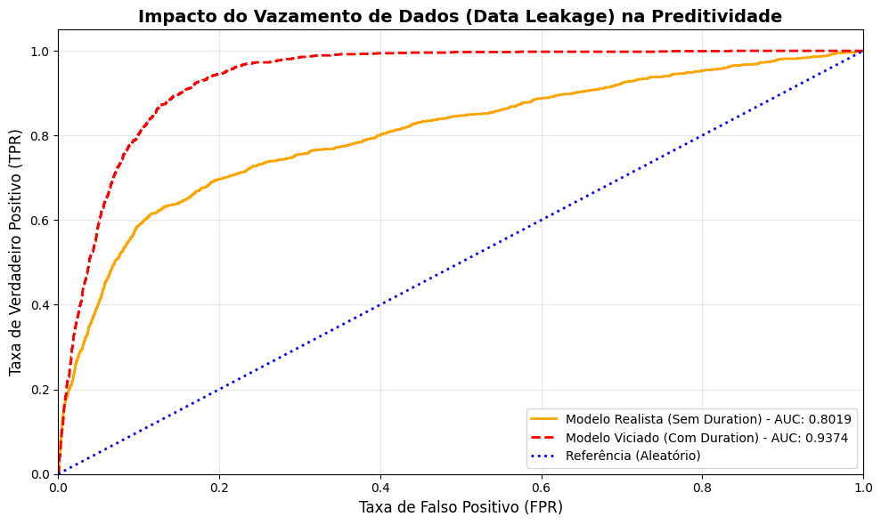

# Análise de Marketing Bancário: Prevendo Adesão a Depósitos a Prazo
 
## 🎯 Contexto e Problema de Negócio
Um banco português realizou campanhas de telemarketing para vender depósitos a prazo. Este projeto responde a uma pergunta central: **quais fatores mais influenciam a adesão do cliente, e é possível prever com antecedência quem tem maior chance de aceitar a oferta?**
 
Esse tipo de análise é aplicável a qualquer negócio que precise priorizar leads e otimizar esforço comercial.
 
## 📊 Sobre os Dados
- Fonte: https://raw.githubusercontent.com/akhil12028/Bank-Marketing-data-set-analysis/master/bank-additional-full.csv
- Volume: 41188 registros, 21 variáveis (idade, profissão, histórico de contato, indicadores econômicos, etc.)
- Variável-alvo: adesão ao depósito (sim/não)
  
## 🔍 O que foi feito
1. **Análise Exploratória (EDA)** — identificação de padrões demográficos e comportamentais associados à adesão
2. **Modelagem preditiva** — regressão logística, testada com e sem a variável `duration` (duração da chamada), já que essa variável só é conhecida *depois* da ligação e pode enviesar o modelo se usada ingenuamente
3. **Avaliação de performance** — comparação de métricas entre os dois modelos

## 💡 Principais Insights
- **Insight 1 — Perfil:** aposentados, acima de 60 anos e estudantes lideram taxa de conversão
- **Insight 2 — Impacto de remover `duration` na acurácia/interpretabilidade do modelo:** Remover a variável duration reduz o poder preditivo do modelo de AUC-ROC 0,94 para 0,80 — uma queda esperada e correta, já que duration só é conhecida depois da ligação acontecer. O modelo "viciado" (com duration) parece 14 pontos mais forte, mas essa força é artificial: ele não pode ser usado na prática, porque o banco precisa decidir antes de ligar. O modelo realista (0,80 de AUC) é o que reflete o poder de previsão de verdade disponível ao negócio.
- **Insight 3 — Trade-off entre precisão e recall, ajustado ao problema de negócio:** A classe "Aderiu" representa apenas ~11% da base (1.392 de 12.353 no teste), então o modelo foi treinado com class_weight='balanced' para não simplesmente prever "não adere" o tempo todo. O resultado é um recall de 65% para quem adere, mas precisão de apenas 35% — ou seja, o modelo prioriza não deixar escapar clientes com potencial de adesão, mesmo à custa de contatar alguns que não vão converter. Essa é uma escolha proposital e alinhada ao negócio: o custo de uma ligação extra é bem menor que o custo de perder um cliente que aderiria.


 
## 📈 Visualizações


 
## 🛠️ Ferramentas
Python · Pandas · Scikit-learn · Matplotlib/Seaborn · Google Colab
 
## 📁 Estrutura do Repositório
```
├── notebook/
│   └── analise_marketing_bancario.ipynb
├── relatorio/
│   └── bank_marketing_presentation.pdf 
├── imagens/
│   └── graficos usados no README
└── README.md
```
 
## 🔗 Links
- Notebook interativo (Colab): https://colab.research.google.com/drive/1Qyxv5laqR9qPXCjbOORwbqxCC6SYr0rI?usp=sharing
